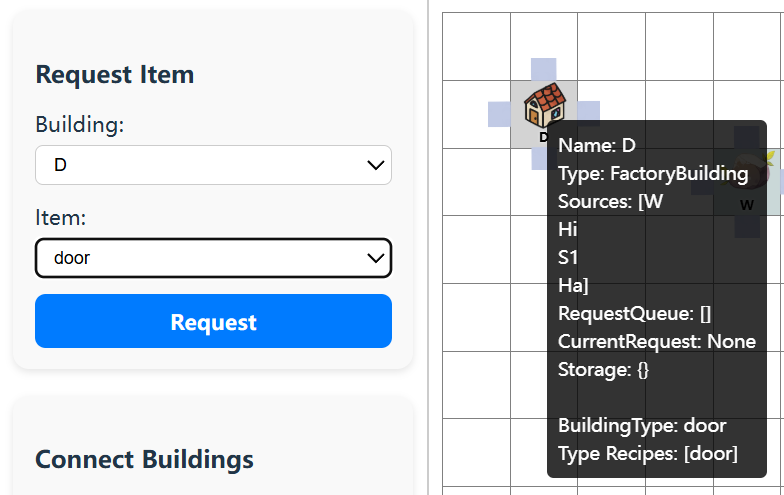
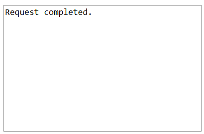
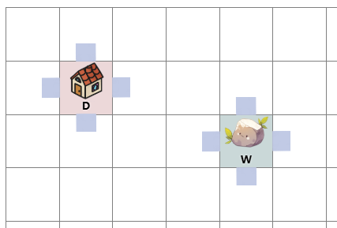
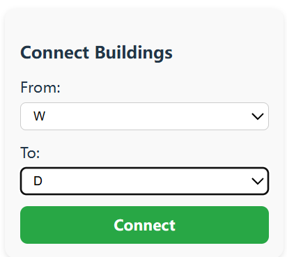
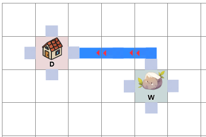
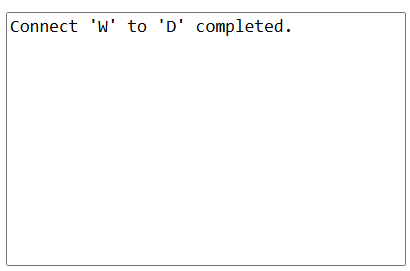
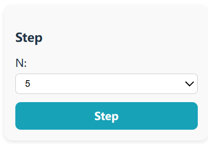
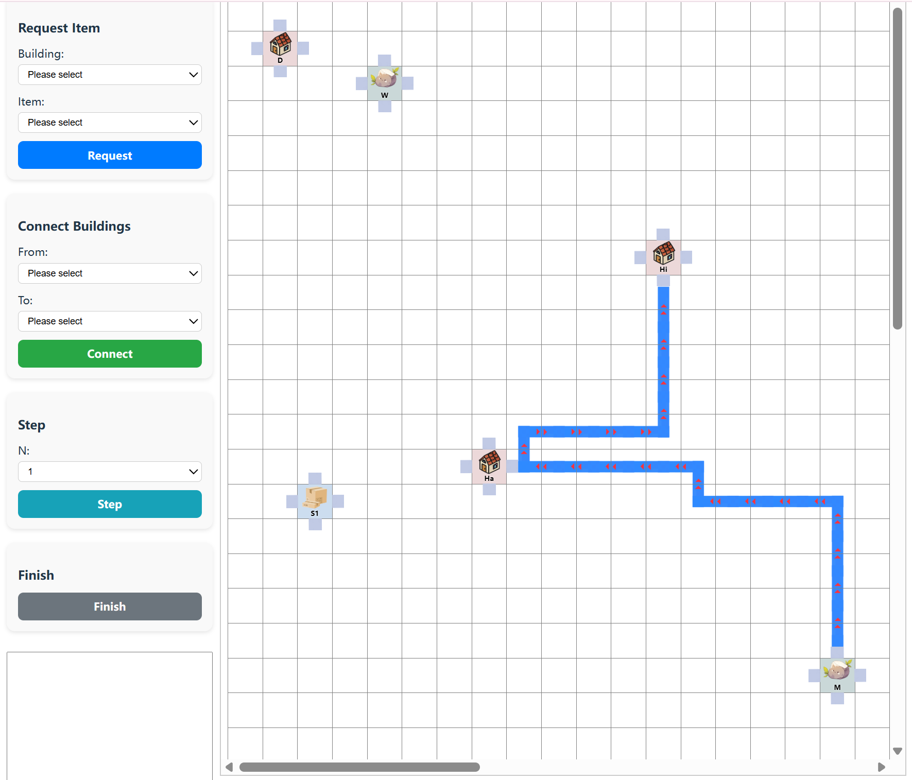
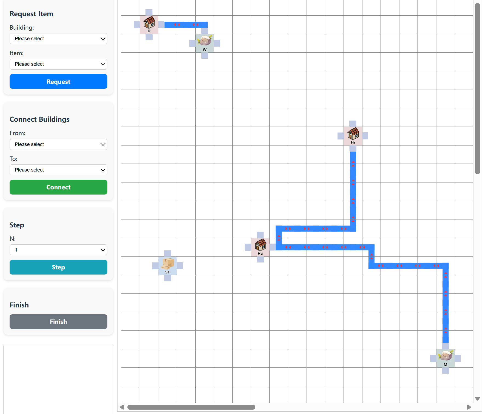
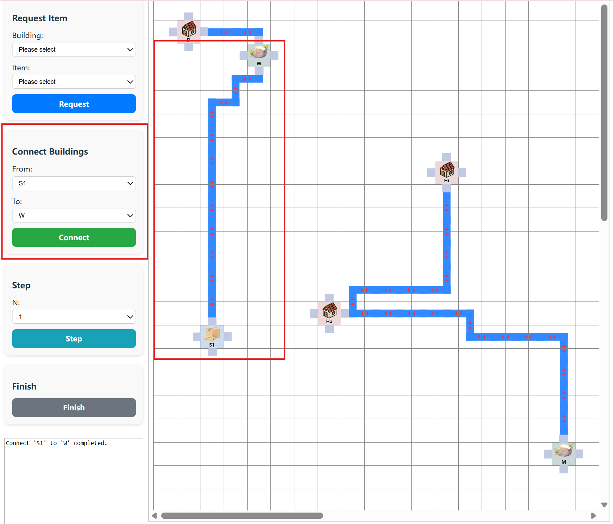

# Simulation Project

## Overview

This project is a simulation engine implemented in Java. It processes a simulation configuration specified in a JSON file that defines recipes, building types, and buildings. After successful parsing and validation, the simulation enters an interactive command loop where the user can input commands to request items, advance simulation time, change verbosity, or finish the simulation.

## Features

- **JSON Parsing:** Uses the [org.json](https://github.com/stleary/JSON-java) library to parse configuration files.

- **Input Validation:** Comprehensive validation of recipes, building types, and buildings ensuring that required fields exist and cross-references are valid.

- Interactive Commands:

   Supports four commands:

  - `request 'ITEM' from 'BUILDING'`
  - `step N` (N must be an integer ≥ 1)
  - `finish`
  - `verbose N`
  - `rate N` (N must be an integer ≥ 0)
  - `pause`

- **Modular Design:** Clear separation of concerns across multiple classes with dedicated responsibilities.

- **Custom Exceptions:** Uses a custom `SimulationException` to signal validation and processing errors.

- **Extensive Testing:** Includes a comprehensive suite of JUnit tests covering both normal and edge cases.

## Project Structure

The source code is organized in the `simulation` package:

- Domain Classes:
  - `Recipe`, `BuildingType`, `Building` (abstract), `FactoryBuilding`, and `MineBuilding`
  - `Request` represents a production request.
- Core Engine:
  - `Simulation` (interface) and its implementation `BasicSimulation`
  - `SimulationParser` for parsing and validating JSON configuration.
  - `CommandProcessor` and related command classes (`RequestCommand`, `StepCommand`, `FinishCommand`, `VerboseCommand`) for processing user commands.
- Exception Handling:
  - `SimulationException` to signal errors during simulation setup or processing.
- Entry Point:
  - `Main` class to start the simulation and enter the interactive loop.

## Requirements

- **Java:** JDK 8 or later.
- **JSON Library:** [org.json](https://github.com/stleary/JSON-java)
- **JUnit 5:** For unit testing.

## How to Include the JSON Library

### Gradle

Add the following to your build.gradle file:

```groovy
dependencies {
    implementation 'org.json:json:20220320'
}
```


### Direct Download

Download the JAR from the Maven Central Repository and include it in your project’s classpath.

## Building the Project

### Using Gradle

Build the project with:

```shell
gradle build
```


## Running the Simulation

To run the simulation, execute the Main class and pass the JSON configuration file as an argument:

```shell
./build/install/ProductSimulation/bin/ProductSimulation src/test/resources/inputs/doors1.json
```


You will see a prompt (e.g., 0>) where you can type your commands.

## Running Tests

Run tests using:

```shell
gradle test
```

# Play the Game

## Server:

Use the following command to run the server with testing input  in`phase2_1.json` in the terminal:

```bash
./gradlew ServerMain --args='src/test/resources/inputs/phase2_1.json'
```

It should look like this: (The original map read from json file should be printed in the beginning.)

```bash
> Task :ServerMain
Map:
      1   2   3   4   5   6   7   8   9  10  11  12  13  14  15  16  17 
    -------------------------------------------------------------------------------------
  1| D |   |   |   |   |   |   |   |   |   |   |   |   |   |   |   |   |
    -------------------------------------------------------------------------------------
  2|   |   |   | W |   |   |   |   |   |   |   |   |   |   |   |   |   |
    -------------------------------------------------------------------------------------
  3|   |   |   |   |   |   |   |   |   |   |   |   |   |   |   |   |   |
    -------------------------------------------------------------------------------------
  4|   |   |   |   |   |   |   |   |   |   |   |   |   |   |   |   |   |
    -------------------------------------------------------------------------------------
  5|   |   |   |   |   |   |   |   |   |   |   |   |   |   |   |   |   |
    -------------------------------------------------------------------------------------
  6|   |   |   |   |   |   |   |   |   |   |   |   |   |   |   |   |   |
    -------------------------------------------------------------------------------------
  7|   |   |   |   |   |   |   |   |   |   |   | Hi|   |   |   |   |   |
    -------------------------------------------------------------------------------------
  8|   |   |   |   |   |   |   |   |   |   |   | l |   |   |   |   |   |
    -------------------------------------------------------------------------------------
  9|   |   |   |   |   |   |   |   |   |   |   | l |   |   |   |   |   |
    -------------------------------------------------------------------------------------
 10|   |   |   |   |   |   |   |   |   |   |   | l |   |   |   |   |   |
    -------------------------------------------------------------------------------------
 11|   |   |   |   |   |   |   |   |   |   |   | l |   |   |   |   |   |
    -------------------------------------------------------------------------------------
 12|   |   |   |   |   |   |   | F | - | - | - | J |   |   |   |   |   |
    -------------------------------------------------------------------------------------
 13|   |   |   |   |   |   | Ha| L | - | - | - | - | 7 |   |   |   |   |
    -------------------------------------------------------------------------------------
 14|   | S1|   |   |   |   |   |   |   |   |   |   | L | - | - | - | 7 |
    -------------------------------------------------------------------------------------
 15|   |   |   |   |   |   |   |   |   |   |   |   |   |   |   |   | l |
    -------------------------------------------------------------------------------------
 16|   |   |   |   |   |   |   |   |   |   |   |   |   |   |   |   | l |
    -------------------------------------------------------------------------------------
 17|   |   |   |   |   |   |   |   |   |   |   |   |   |   |   |   | l |
    -------------------------------------------------------------------------------------
 18|   |   |   |   |   |   |   |   |   |   |   |   |   |   |   |   | l |
    -------------------------------------------------------------------------------------
 19|   |   |   |   |   |   |   |   |   |   |   |   |   |   |   |   | M |
    -------------------------------------------------------------------------------------
     1   2   3   4   5   6   7   8   9  10  11  12  13  14  15  16  17 

Server started on port 3000.
<=========----> 75% EXECUTING [1m 16s]
> :ServerMain
```

- Quit server program by entering `C + c`.
- Pause: pause game by `pause`
- Change the speed of global time to N: `rate N`
  - N must be an non-negative integer.

## Client:

Go to the root directory of the client project:

```bash
cd <whatever path>/651-simulationclient
```

Install main in the root directory of the project:
```bash
npm install   # only needed for the first time
```

Run npm in the project:
```bash
npm run dev
```

Open the url to client webpage:
```bash
#something like http://127.0.0.1:5173/
```

### Client Terminal:

Run Client in the terminal:

```bash
./gradlew ClientMain
```

It should look like this (The original map and relevant info read from the json file should be printed in the beginning):

```bash
> Task :ClientMain
======== Simulation State ========
Current Time Step: 0
Verbosity Level  : 0
Buildings        : Hi, D, W, Ha, M, S1
Recipes          : door, hinge, metal, handle, wood
Map Text         :
Map:
      1   2   3   4   5   6   7   8   9  10  11  12  13  14  15  16  17 
    -------------------------------------------------------------------------------------
  1| D |   |   |   |   |   |   |   |   |   |   |   |   |   |   |   |   |
    -------------------------------------------------------------------------------------
  2|   |   |   | W |   |   |   |   |   |   |   |   |   |   |   |   |   |
    -------------------------------------------------------------------------------------
  3|   |   |   |   |   |   |   |   |   |   |   |   |   |   |   |   |   |
    -------------------------------------------------------------------------------------
  4|   |   |   |   |   |   |   |   |   |   |   |   |   |   |   |   |   |
    -------------------------------------------------------------------------------------
  5|   |   |   |   |   |   |   |   |   |   |   |   |   |   |   |   |   |
    -------------------------------------------------------------------------------------
  6|   |   |   |   |   |   |   |   |   |   |   |   |   |   |   |   |   |
    -------------------------------------------------------------------------------------
  7|   |   |   |   |   |   |   |   |   |   |   | Hi|   |   |   |   |   |
    -------------------------------------------------------------------------------------
  8|   |   |   |   |   |   |   |   |   |   |   | l |   |   |   |   |   |
    -------------------------------------------------------------------------------------
  9|   |   |   |   |   |   |   |   |   |   |   | l |   |   |   |   |   |
    -------------------------------------------------------------------------------------
 10|   |   |   |   |   |   |   |   |   |   |   | l |   |   |   |   |   |
    -------------------------------------------------------------------------------------
 11|   |   |   |   |   |   |   |   |   |   |   | l |   |   |   |   |   |
    -------------------------------------------------------------------------------------
 12|   |   |   |   |   |   |   | F | - | - | - | J |   |   |   |   |   |
    -------------------------------------------------------------------------------------
 13|   |   |   |   |   |   | Ha| L | - | - | - | - | 7 |   |   |   |   |
    -------------------------------------------------------------------------------------
 14|   | S1|   |   |   |   |   |   |   |   |   |   | L | - | - | - | 7 |
    -------------------------------------------------------------------------------------
 15|   |   |   |   |   |   |   |   |   |   |   |   |   |   |   |   | l |
    -------------------------------------------------------------------------------------
 16|   |   |   |   |   |   |   |   |   |   |   |   |   |   |   |   | l |
    -------------------------------------------------------------------------------------
 17|   |   |   |   |   |   |   |   |   |   |   |   |   |   |   |   | l |
    -------------------------------------------------------------------------------------
 18|   |   |   |   |   |   |   |   |   |   |   |   |   |   |   |   | l |
    -------------------------------------------------------------------------------------
 19|   |   |   |   |   |   |   |   |   |   |   |   |   |   |   |   | M |
    -------------------------------------------------------------------------------------
     1   2   3   4   5   6   7   8   9  10  11  12  13  14  15  16  17 

==================================

Please enter Instruction (`exit` for quit): 
<=========----> 75% EXECUTING [10s]
> :ClientMain
```

#### Commands:

1. Request Item: `request '<item>' from '<building>'`
2. Connect Buildings: `connect '<building 1>' to '<building 2>'`
3. Step: `step N`
4. Set verbose level: `verbose i`
5. Finish: `finish`
6. Print the map: `printMap`
7. Exit: `exit`

### Client Webpage:

The initial status should be like this:


#### 1. Request Item:

- Choose <Building> and <Item> in the list;

- You could see each building’s recipes by moving the cursor onto it:

  

  

### 2. Connect Buildings:

- Choose two buildings to connect in <from> and <to>

  

  

- Click on “Connect”, it should build a directed road from W to D:

  

  

### 3. Step:

- Choose step number N:

  

### 4. Finish:

### Webpage and Terminal Consistency:

1. In the beginning:

   ```bash
   > Task :ClientMain
   ======== Simulation State ========
   Current Time Step: 0
   Verbosity Level  : 0
   Buildings        : Hi, D, W, Ha, M, S1
   Recipes          : door, hinge, metal, handle, wood
   Map Text         :
   Map:
         1   2   3   4   5   6   7   8   9  10  11  12  13  14  15  16  17 
       -------------------------------------------------------------------------------------
     1| D |   |   |   |   |   |   |   |   |   |   |   |   |   |   |   |   |
       -------------------------------------------------------------------------------------
     2|   |   |   | W |   |   |   |   |   |   |   |   |   |   |   |   |   |
       -------------------------------------------------------------------------------------
     3|   |   |   |   |   |   |   |   |   |   |   |   |   |   |   |   |   |
       -------------------------------------------------------------------------------------
     4|   |   |   |   |   |   |   |   |   |   |   |   |   |   |   |   |   |
       -------------------------------------------------------------------------------------
     5|   |   |   |   |   |   |   |   |   |   |   |   |   |   |   |   |   |
       -------------------------------------------------------------------------------------
     6|   |   |   |   |   |   |   |   |   |   |   |   |   |   |   |   |   |
       -------------------------------------------------------------------------------------
     7|   |   |   |   |   |   |   |   |   |   |   | Hi|   |   |   |   |   |
       -------------------------------------------------------------------------------------
     8|   |   |   |   |   |   |   |   |   |   |   | l |   |   |   |   |   |
       -------------------------------------------------------------------------------------
     9|   |   |   |   |   |   |   |   |   |   |   | l |   |   |   |   |   |
       -------------------------------------------------------------------------------------
    10|   |   |   |   |   |   |   |   |   |   |   | l |   |   |   |   |   |
       -------------------------------------------------------------------------------------
    11|   |   |   |   |   |   |   |   |   |   |   | l |   |   |   |   |   |
       -------------------------------------------------------------------------------------
    12|   |   |   |   |   |   |   | F | - | - | - | J |   |   |   |   |   |
       -------------------------------------------------------------------------------------
    13|   |   |   |   |   |   | Ha| L | - | - | - | - | 7 |   |   |   |   |
       -------------------------------------------------------------------------------------
    14|   | S1|   |   |   |   |   |   |   |   |   |   | L | - | - | - | 7 |
       -------------------------------------------------------------------------------------
    15|   |   |   |   |   |   |   |   |   |   |   |   |   |   |   |   | l |
       -------------------------------------------------------------------------------------
    16|   |   |   |   |   |   |   |   |   |   |   |   |   |   |   |   | l |
       -------------------------------------------------------------------------------------
    17|   |   |   |   |   |   |   |   |   |   |   |   |   |   |   |   | l |
       -------------------------------------------------------------------------------------
    18|   |   |   |   |   |   |   |   |   |   |   |   |   |   |   |   | l |
       -------------------------------------------------------------------------------------
    19|   |   |   |   |   |   |   |   |   |   |   |   |   |   |   |   | M |
       -------------------------------------------------------------------------------------
        1   2   3   4   5   6   7   8   9  10  11  12  13  14  15  16  17 
   
   ==================================
   ```

   

2. `connect 'W' to 'D'` in the terminal:

   ```bash
   Current Time Step: 0
   Verbosity Level  : 0
   Buildings        : Hi, D, W, Ha, M, S1
   Recipes          : door, hinge, metal, handle, wood
   Map Text         :
   Map:
         1   2   3   4   5   6   7   8   9  10  11  12  13  14  15  16  17 
       -------------------------------------------------------------------------------------
     1| D | - | - | 7 |   |   |   |   |   |   |   |   |   |   |   |   |   |
       -------------------------------------------------------------------------------------
     2|   |   |   | W |   |   |   |   |   |   |   |   |   |   |   |   |   |
       -------------------------------------------------------------------------------------
     3|   |   |   |   |   |   |   |   |   |   |   |   |   |   |   |   |   |
       -------------------------------------------------------------------------------------
     4|   |   |   |   |   |   |   |   |   |   |   |   |   |   |   |   |   |
       -------------------------------------------------------------------------------------
     5|   |   |   |   |   |   |   |   |   |   |   |   |   |   |   |   |   |
       -------------------------------------------------------------------------------------
     6|   |   |   |   |   |   |   |   |   |   |   |   |   |   |   |   |   |
       -------------------------------------------------------------------------------------
     7|   |   |   |   |   |   |   |   |   |   |   | Hi|   |   |   |   |   |
       -------------------------------------------------------------------------------------
     8|   |   |   |   |   |   |   |   |   |   |   | l |   |   |   |   |   |
       -------------------------------------------------------------------------------------
     9|   |   |   |   |   |   |   |   |   |   |   | l |   |   |   |   |   |
       -------------------------------------------------------------------------------------
    10|   |   |   |   |   |   |   |   |   |   |   | l |   |   |   |   |   |
       -------------------------------------------------------------------------------------
    11|   |   |   |   |   |   |   |   |   |   |   | l |   |   |   |   |   |
       -------------------------------------------------------------------------------------
    12|   |   |   |   |   |   |   | F | - | - | - | J |   |   |   |   |   |
       -------------------------------------------------------------------------------------
    13|   |   |   |   |   |   | Ha| L | - | - | - | - | 7 |   |   |   |   |
       -------------------------------------------------------------------------------------
    14|   | S1|   |   |   |   |   |   |   |   |   |   | L | - | - | - | 7 |
       -------------------------------------------------------------------------------------
    15|   |   |   |   |   |   |   |   |   |   |   |   |   |   |   |   | l |
       -------------------------------------------------------------------------------------
    16|   |   |   |   |   |   |   |   |   |   |   |   |   |   |   |   | l |
       -------------------------------------------------------------------------------------
    17|   |   |   |   |   |   |   |   |   |   |   |   |   |   |   |   | l |
       -------------------------------------------------------------------------------------
    18|   |   |   |   |   |   |   |   |   |   |   |   |   |   |   |   | l |
       -------------------------------------------------------------------------------------
    19|   |   |   |   |   |   |   |   |   |   |   |   |   |   |   |   | M |
       -------------------------------------------------------------------------------------
        1   2   3   4   5   6   7   8   9  10  11  12  13  14  15  16  17 
   
   ==================================
   ```

   

3. Connect <S1> to <W> in the webpage:

   

   printMap in the terminal:

   ```bash
   <<=====<=========----> 75% EXECUTING [8m 51s======== Simulation State ========
   Current Time Step: 0
   Verbosity Level  : 0
   Buildings        : Hi, D, W, Ha, M, S1
   Recipes          : door, hinge, metal, handle, wood
   Map Text         :
   Map:
         1   2   3   4   5   6   7   8   9  10  11  12  13  14  15  16  17 
       -------------------------------------------------------------------------------------
     1| D | - | - | 7 |   |   |   |   |   |   |   |   |   |   |   |   |   |
       -------------------------------------------------------------------------------------
     2|   |   |   | W |   |   |   |   |   |   |   |   |   |   |   |   |   |
       -------------------------------------------------------------------------------------
     3|   |   | F | - |   |   |   |   |   |   |   |   |   |   |   |   |   |
       -------------------------------------------------------------------------------------
     4|   | F | J |   |   |   |   |   |   |   |   |   |   |   |   |   |   |
       -------------------------------------------------------------------------------------
     5|   | l |   |   |   |   |   |   |   |   |   |   |   |   |   |   |   |
       -------------------------------------------------------------------------------------
     6|   | l |   |   |   |   |   |   |   |   |   |   |   |   |   |   |   |
       -------------------------------------------------------------------------------------
     7|   | l |   |   |   |   |   |   |   |   |   | Hi|   |   |   |   |   |
       -------------------------------------------------------------------------------------
     8|   | l |   |   |   |   |   |   |   |   |   | l |   |   |   |   |   |
       -------------------------------------------------------------------------------------
     9|   | l |   |   |   |   |   |   |   |   |   | l |   |   |   |   |   |
       -------------------------------------------------------------------------------------
    10|   | l |   |   |   |   |   |   |   |   |   | l |   |   |   |   |   |
       -------------------------------------------------------------------------------------
    11|   | l |   |   |   |   |   |   |   |   |   | l |   |   |   |   |   |
       -------------------------------------------------------------------------------------
    12|   | l |   |   |   |   |   | F | - | - | - | J |   |   |   |   |   |
       -------------------------------------------------------------------------------------
    13|   | l |   |   |   |   | Ha| L | - | - | - | - | 7 |   |   |   |   |
       -------------------------------------------------------------------------------------
    14|   | S1|   |   |   |   |   |   |   |   |   |   | L | - | - | - | 7 |
       -------------------------------------------------------------------------------------
    15|   |   |   |   |   |   |   |   |   |   |   |   |   |   |   |   | l |
       -------------------------------------------------------------------------------------
    16|   |   |   |   |   |   |   |   |   |   |   |   |   |   |   |   | l |
       -------------------------------------------------------------------------------------
    17|   |   |   |   |   |   |   |   |   |   |   |   |   |   |   |   | l |
       -------------------------------------------------------------------------------------
    18|   |   |   |   |   |   |   |   |   |   |   |   |   |   |   |   | l |
       -------------------------------------------------------------------------------------
    19|   |   |   |   |   |   |   |   |   |   |   |   |   |   |   |   | M |
       -------------------------------------------------------------------------------------
        1   2   3   4   5   6   7   8   9  10  11  12  13  14  15  16  17 
   
   ==================================
   ```

   


